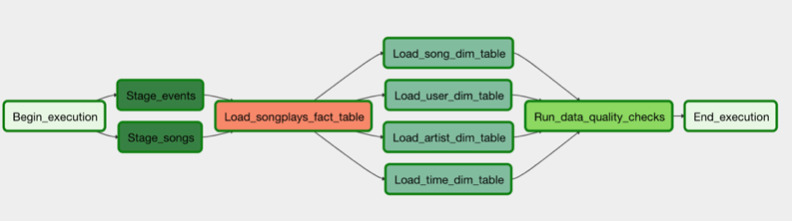

# Data-pipeline-with-Airflow
automate solution to run task on AWS

## Introduction

The music streaming company Sparkify decide to automate their data warehouse ETL pipelines. Our goal is to create our  own custom operators to perform tasks such as staging the data, filling the data warehouse, and running checks on the data as the final step.

Before choose the tool to achieve that, we considered to run **cron** , which is a simple and effective way to execute the jobs. However, the limitation of cron is appeared over time as data and the demand for more reports increased. It became difficult to estimate the time a particular job would take.  It often run into lock wait timeouts and deadlocks. Thus, we need a dedicated tool can overcome it. The **Apache Airflow** provides below functions: 
  - Handle complex relationships between jobs.
  - Handle all the jobs centrally with a well defined user interface.
  - Error reporting and alerting.
  - Viewing and analyzing job run times.
  - Security (protecting credentials of databases).

has decided that it is time to introduce more automation and monitoring to their data warehouse ETL pipelines and come to the conclusion that the best tool to achieve this is Apache Airflow.

The source data resides in Amazon S3 and needs to be processed in data warehouse in Amazon Redshift. The source datasets consist of two kind of JSON logs. One is user activity in the application. The other is the songs information.

## Operators
There are four different operators that will stage the data, transform the data, and run checks on data quality.

All of the operators and task instances will run SQL statements against the Redshift database. Using parameters to build flexible, reusable, and configurable operators can later apply to many kinds of data pipelines with Redshift and with other databases.

### Stage Operator
The stage operator is expected to be able to load any JSON formatted files from S3 to Amazon Redshift. The operator creates and runs a SQL COPY statement based on the parameters provided. The operator's parameters should specify where in S3 the file is loaded and what is the target table.
The parameters should be used to distinguish between JSON file. Another important requirement of the stage operator is containing a templated field that allows it to load timestamped files from S3 based on the execution time and run backfills.
Fact and Dimension Operators

### Dimension and fact operators 
the SQL helper class to run data transformations. Most of the logic is within the SQL transformations and the operator is expected to take as input a SQL statement and target database on which to run the query against. 

Dimension loads are often done with the truncate-insert pattern where the target table is emptied before the load. Fact tables are usually so massive that they should only allow append type functionality.

### Data Quality Operator
The final operator to create is the data quality operator, which is used to run checks on the data itself. The operator's main functionality is to receive one or more SQL based test cases along with the expected results and execute the tests. For each the test, the test result and expected result needs to be checked and if there is no match, the operator should raise an exception and the task should retry and fail eventually.
For example one test could be a SQL statement that checks if certain column contains NULL values by counting all the rows that have NULL in the column. We do not want to have any NULLs so expected result would be 0 and the test would compare the SQL statement's outcome to the expected result.

## Workspace
After you have updated the DAG, you will need to run /opt/airflow/start.sh command to start the Airflow web server. Once the Airflow web server is ready, you can access the Airflow UI by clicking on the blue Access Airflow button.

## Data
the same used in the project of spark data lake
https://github.com/xz-xiong/AWS-Spark-Data-Lake/tree/master/data
